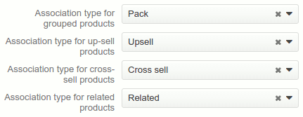

# Fields available in the Magento connector export profiles

## Common fields to all export profiles

These are the basic configuration fields that allow to configure the connection between Akeneo and Magento.

**Basic export configuration:**

Here you have to complete the information allowing the Magento connector to access your Magento:

- the soap user and the Soap api key you've defined in Magento,
- the url of your Magento and the Wsdl url (this last one should already be completed at the profile creation),
- optional: the http login and password protecting the acces of your Magento (if there is any, of course),
- the default Magento store view (which is name `default` on Magento first install),
- the default Akeneo locale you want to map to this default storeview,
- the magento website on which you want to send your data (`base` on default Magento installation).

**Locales mapping:**

In addition to the default locale, you can map as many Akeneo locales you want to other Magento store views.

## Attributes and attribute sets export profile

**Attribute not in PIM anymore:**

Choose if you want the Magento connector to delete attributes and attribute sets that do not exists in Akeneo anymore, or to let these attributes untouched in Magento.

**Force attribute set removing:**

If an attribute set is deleted from Akeneo, then you can let the connector delete it in Mangento. However, if there still is products attached to this attribute set, then you have to force Magento to delete these products with it, or the attribute set will remain intact.

**Attribute mapping:**

Choose how to map your Akeneo attributes to your Magento attributes. The profile give you a default mapping for the Magento mandatory attributes. However, you can choose whatever Akeneo attributes you want to map with them.

You don't have to map all attributes: the non mapped Akeneo attributes will automatically be mapped to a Magento attribute with the same code. If there is not, then an attribute will be created on Magento.

Remember that Magento system attributes cannot be modified, so be sure that the corresponding Akeneo attributes are identical.

## Categories export profile

**Category is anchor:**

Allow you to choose if a category is to be navigated in the layered navigation way or in the traditional category/subcategory way.

**Category url key:**

Choose if you want that the connector generates the generation of the url key or if you prefer that Magento handles them (with the risk that Magento make duplications).

**Category mapping:**

Choose which Akeneo tree you want to map with which Magento category (usually it should be the default Magento category).

**Category not in Akeneo anymore:**

Deleting a category in Akeneo doesn't mean it has to disappear from Magento. You can choose to delete it, but you can also choose to simply disable it, or leave it as it is.

## Product export profile

**Status on Magento:**

Choose of you product is enable or not in Magento.

**Product visibility:**

You can choose the visibility of your products, and for the simple products that are member of a configurable product. Choices are:

1. not visible individualy,
2. catalog,
3. search,
4. catalog and search.

**Currency:**

Choose the currency you use in Magento

**Images:**

Choose what images stored in Akeneo you want to export to Magento.

**Product url keys:**

Choose if you want that the connector generates the generation of the url key or if you prefer that Magento handles them (with the risk that Magento make duplications).

If you let the connector generate them, as sometimes Magento truncate too long url keys, you can choose to put the product SKU at the beginning of the url keys rather than at the end. It will prevent duplications.

**Category mapping:**

Choose which Akeneo tree you want to map with which Magento category (usually it should be the default Magento category).

**Attribute mapping:**

Choose how to map your Akeneo attributes to your Magento attributes. This mapping must be the same than the one in the attribute export profile.

**Product associations:**

Here, you can map the product association types between Akeneo and Magento.

**Product not in Akeneo anymore:**

Like the categories, you can choose to delete, disable or let untouched product that are not in Akeneo anymore, but also products that are not complete anymore.

What's more, there is some product types (downloadable, bundle and virtual) that do not exist in Akeneo. You can choose to let them be or to delete them on your product export.
